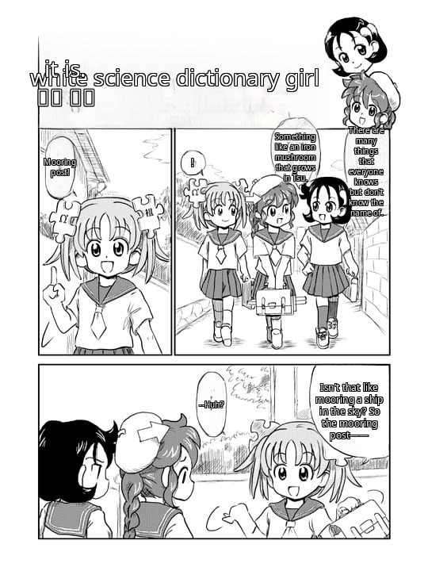

# comic-translate-4-free

**言語：** [English](README.md) · [हिन्दी](README.hi.md) · [日本語](README.ja.md) · [한국어](README.ko.md) · [简体中文](README.zh-CN.md) · [繁體中文](README.zh-TW.md) · [Español](README.es.md) · [العربية](README.ar.md) · [Français](README.fr.md) · [বাংলা](README.bn.md) · [Português](README.pt.md) · [Русский](README.ru.md) · [Tiếng Việt](README.vi.md) · [Bahasa Indonesia](README.id.md) · [اردو](README.ur.md) · [Deutsch](README.de.md)

マンガをあなたの言語で — ブラウザ上でそのまま読めます。

comic-translate-4-free は、閲覧中のマンガやコミックのページを自動で翻訳します。日本語、英語、簡体字・繁体字中国語に対応し（自動検出あり）、114 言語へ翻訳できます。ページを開くだけで、翻訳版の画像がその場で元の画像に置き換わります — 吹き出しがあなたの言語で埋め尽くされます。

### 📸 ビフォア & アフター

| ビフォア（日本語） | アフター（英語） |
| --- | --- |
|  |  |

他の 14 言語への翻訳を見る

| ヒンディー語 | 韓国語 | 簡体字中国語 |
| --- | --- | --- |
|  |  |  |

| 繁体字中国語 | スペイン語 | アラビア語 |
| --- | --- | --- |
|  |  |  |

| フランス語 | ベンガル語 | ポルトガル語 |
| --- | --- | --- |
|  |  |  |

| ロシア語 | ベトナム語 | インドネシア語 |
| --- | --- | --- |
|  |  |  |

| ウルドゥー語 | ドイツ語 |
| --- | --- |
|  |  |

*Kasuga氏による Wikipe-tan の原画（[Wikipedia の Manga の記事](https://en.wikipedia.org/wiki/Manga)より、Wikimedia Commons 経由）— [CC BY-SA 3.0](https://creativecommons.org/licenses/by-sa/3.0/) の下でライセンスされています。翻訳後のスクリーンショットは、原画を改変した二次的著作物です。*

---

## ✨ 機能

- **自動翻訳** — 許可したサイトでマンガページを開くだけで、翻訳版がその場に表示されます。ボタンをクリックする必要はありません。
- **画像を右クリック** — 「Send to comic-translate-4-free」を選ぶと、特定の画像だけを翻訳できます。最小サイズより小さい画像でも大丈夫です。
- **114 言語へ翻訳** — Google 翻訳、Azure Translator、またはローカルの LM Studio サーバー経由で翻訳します。
- **原文言語の自動検出** — OCR で読み取ったテキストから、日本語・英語・簡体字／繁体字中国語を自動的に判別します。
- **縦長ストリップ／ウェブトゥーン対応** — 長いページは重なり合うセグメントに分けて処理するので、文字がシャープなまま残ります。
- **16 言語の UI** — 拡張機能のインターフェースはブラウザの言語設定に追従します。

### 🔒 プライバシー

- **AI はあなたのマシン上で動作します。** 吹き出し検出、OCR、インペインティングはすべて WebAssembly によってブラウザ内でローカル実行されます。ページがデバイスの外に出ることはありません。
- **外部に送信されるのは翻訳テキストのみ** — 選択した翻訳サービス（Google／Azure／ローカルの LM Studio）に送られるのは抽出された文字列だけです。
- **アカウント不要、追跡なし、テレメトリなし。** 設定もキャッシュされたモデルもすべてブラウザのローカルストレージに保存されます。

---

## 🚀 インストール

**Chrome / Edge / Brave:**

[**Chrome ウェブストアからインストール**](https://chromewebstore.google.com/detail/pndooikgcenncdohfggodonniihplppj) — ワンクリックでインストール、自動更新されます。

**Firefox:** [Releases](https://github.com/jameslee0623/comic-translate-4-free/releases) から Firefox 用 zip をダウンロードし、`about:debugging#/runtime/this-firefox` を開いて **Load Temporary Add-on** → `manifest.json` を選択します。（一時的なアドオンは再起動すると無効になります。署名済みの AMO 公開を準備中です。）

インストール後、設定ページを開き **すべてのモデルをダウンロード** を一度クリックしてください（検出器・OCR・インペインターで約 350MB）。モデルはブラウザにキャッシュされ、バイトサイズで検証されます。

---

## 💡 使い方

1. **まずサイトを許可する** — 拡張機能のアイコンをクリックし、**このサイトを許可** を押します（**すべてのサイトを許可** の有効化も可）。翻訳は、許可したサイトでのみ動作します。

   

2. **マンガページを再読み込みする** — ページの読み込み時に自動で翻訳が始まります。右上のピルがリアルタイムの進捗を表示します（Capturing → Detecting → OCR → …）。
3. **完了** — ページの画像がその場で翻訳版に置き換わります。

**ヒント：**
- 任意の画像を右クリック → **comic-translate-4-free に送信** で、その画像だけを翻訳できます。

  

- サイトがダウンロードをブロックした場合（HTTP 403）は、拡張機能がバックグラウンドタブ経由で自動的に再試行します。
- 翻訳エンジンは設定で選択できます：Google（無料、キー不要）、Azure Translator（下記からキーを申請 — 月200万文字まで無料）、LM Studio（ローカルサーバー）。
- 設定で **デバッグモード（ステージ検査）** を有効にすると、パイプラインの各ステージを確認できます。

---

## 🔑 Microsoft Azure アカウントの申請方法

翻訳エンジンとして Azure Translator を使うには：

1. Microsoft／hotmail／Azure アカウントを作成／サインインします
2. Azure サブスクリプションを作成します
3. Azure Translator リソースを作成します
4. F0（無料）料金プランを選択します — 月200万文字、期限切れなし
5. リソース管理 → キーとエンドポイント → **KEY 1** と **Location/Region** をコピーします
6. 拡張機能の設定ページに貼り付けます

---

## ❤️ プロジェクトを支援する

この拡張機能が役に立ったと感じたら、開発の支援をご検討ください：

---

## ⚠️ 既知の問題

- **韓国語 OCR は未対応** — 原文言語は日本語、英語、簡体字・繁体字中国語のみです。（韓国語は翻訳先としては選択できます。）
- 自動翻訳は**ページごとに1枚の画像**が対象です（ページのメイン画像）。他の画像は右クリック → Send で翻訳できます。
- **長時間のセッション** — 1 セッションで何十枚も翻訳するとブラウザがクラッシュする場合があります。その場合は設定でページキャッシュをクリアしてください。
- **Firefox** — モデルはバックグラウンドページ上で動作します（オフスクリーンドキュメントなし）。"no available backend found" と表示されたらブラウザを再起動してください。
- Google 翻訳は非公式の無料エンドポイントを使用しているため、レート制限される場合があります。

---

## 📄 サードパーティに関する通知

本プロジェクトは [ogkalu2/comic-translate](https://github.com/ogkalu2/comic-translate) にインスパイアされています — 吹き出し／テキスト検出器と、マンガ用にファインチューンされた LaMa インペインターはその ONNX エクスポートであり、推論ロジックはそこから移植されています。（OCR には genshiai-daichi の [Baberu](https://huggingface.co/genshiai-daichi/baberu-ocr) を使用しています。）

同梱ライブラリ、移植コード、実行時にダウンロードされるモデルは、[THIRD-PARTY-NOTICES.md](THIRD-PARTY-NOTICES.md) にライセンスとともに記載されています。

MIT License — [LICENSE](LICENSE) を参照してください。
