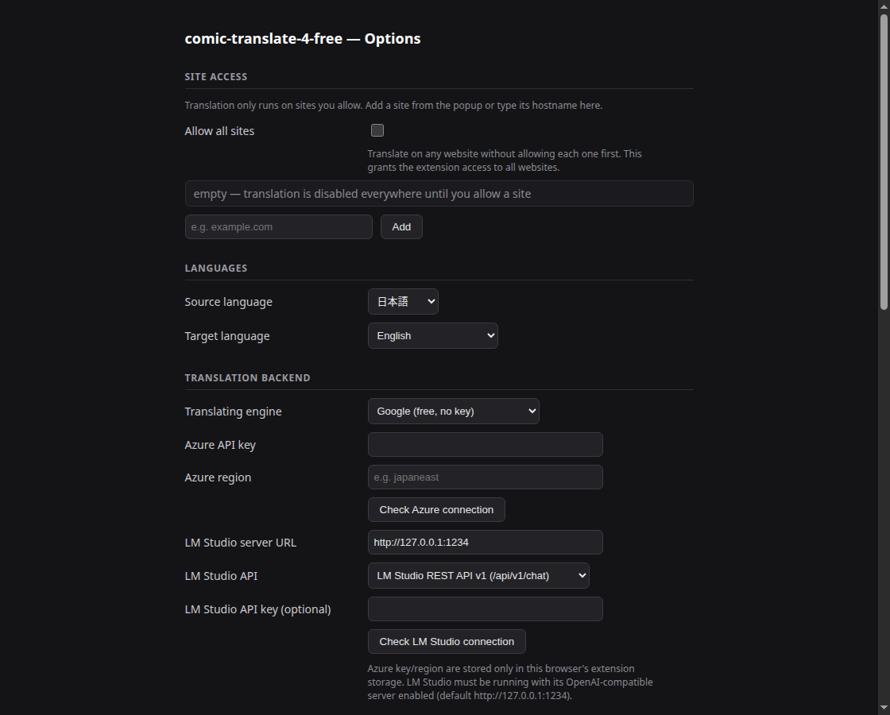

# comic-translate-4-free

**Language:** [English](README.md) · [हिन्दी](README.hi.md) · [日本語](README.ja.md) · [简体中文](README.zh-CN.md) · [繁體中文](README.zh-TW.md) · [Español](README.es.md) · [العربية](README.ar.md) · [Français](README.fr.md) · [اردو](README.ur.md)

براؤزر میں مانگا/کامک صفحات کا ترجمہ کریں۔ مکمل پائپ لائن مقامی طور پر چلتی ہے:
بلبلے/متن کی شناخت (RT-DETR-v2)، OCR (جاپانی/انگریزی/چینی کے لیے Baberu)،
LaMa ان پینٹنگ کے ذریعے متن ہٹانا، ترجمہ (Google / Azure / مقامی LLM)، اور اصل
اسپیچ بلبلوں میں لپیٹ کر دوبارہ رینڈرنگ۔

ایکسٹینشن کا UI آپ کے براؤزر کی زبان کی ترتیب کے مطابق چلتا ہے (انگریزی، جاپانی،
کورین، چینی آسان/روایتی، ہندی، ہسپانوی، عربی، فرانسیسی، اردو)۔

یہ پراجیکٹ [ogkalu2/comic-translate](https://github.com/ogkalu2/comic-translate) سے متاثر ہے۔

## ڈاؤن لوڈ (بلڈ کی ضرورت نہیں)

**Chrome / Edge / Brave — Chrome Web Store سے انسٹال کریں:**

[**Chrome Web Store سے comic-translate-4-free انسٹال کریں**](https://chromewebstore.google.com/detail/pndooikgcenncdohfggodonniihplppj)

یا
[**Releases**](https://github.com/jameslee0623/comic-translate-4-free/releases)
صفحے سے تازہ ترین ریلیز حاصل کریں — ہر ریلیز CI کے ذریعے خودکار بلڈ ہوتی ہے۔
اپنے براؤزر کے لیے zip ڈاؤن لوڈ کریں:

- `comic-translate-4-free-v<version>-<build>-chrome.zip` → Chrome / Edge / Brave
- `comic-translate-4-free-v<version>-<build>-firefox.zip` → Firefox

(ایک مشترکہ `comic-translate-4-free-v<version>-<build>.zip` بھی ہے جس میں
`chrome/` اور `firefox/` ساتھ ساتھ ہیں، اگر آپ دونوں ایک ساتھ چاہتے ہیں۔)
آپ کو کبھی ریپو کلون کرنے یا خود `build.sh` چلانے کی ضرورت نہیں۔

## انسٹال

**Chrome (تجویز کردہ):**
[**Chrome Web Store**](https://chromewebstore.google.com/detail/pndooikgcenncdohfggodonniihplppj)
سے انسٹال کریں — ایک کلک، خودکار اپ ڈیٹس۔

**دستی انسٹال (Chrome):** اوپر Releases سے zip ڈاؤن لوڈ کر کے ان زپ کریں،
پھر `chrome://extensions` → **Developer mode** فعال کریں →
**Load unpacked** → ان زپ شدہ فولڈر منتخب کریں۔

**Firefox:** `about:debugging#/runtime/this-firefox` → **Load Temporary
Add-on** → ان زپ شدہ فولڈر کھولیں اور `manifest.json` منتخب کریں۔ (عارضی
ایڈ آن Firefox دوبارہ شروع ہونے تک رہتے ہیں۔ مستقل انسٹال کے لیے بلڈ کو
addons.mozilla.org پر سائن ہونا ضروری ہے۔ Firefox standard edition کے لیے سائن شدہ
ایکسٹینشن پر کام جاری ہے۔)

پھر Settings صفحے سے ماڈلز ایک بار ڈاؤن لوڈ کریں — ایک
**Download all models** بٹن سب کچھ حاصل کرتا ہے (ڈیٹیکٹر، OCR ماڈلز،
ان پینٹر، مجموعی طور پر ~350 MB)۔ یہ براؤزر (IndexedDB) میں کیش ہوتے ہیں اور کبھی
دوبارہ ڈاؤن لوڈ نہیں ہوتے۔ ڈاؤن لوڈ کے بعد ہر فائل کے بائٹ سائز کی تصدیق ہوتی ہے؛
کٹی ہوئی یا غلط فائل پر ⚠ لگتا ہے اور دوبارہ ڈاؤن لوڈ کی جا سکتی ہے۔


## استعمال

1. **پہلے سائٹ کو اجازت دیں** — ترجمہ صرف ان سائٹس پر چلتا ہے جنہیں آپ واضح
   طور پر اجازت دیتے ہیں۔ ایکسٹینشن آئیکن پر کلک کریں اور **Allow this site**
   دبائیں (یا Settings میں ہوسٹ نام شامل کریں، یا یہ مرحلہ ہر جگہ چھوڑنے کے لیے
   **ALLOW ALL SITES** آن کریں)۔ یہ ایک سخت گیٹ ہے: پائپ لائن کہیں اور
   چلنے سے انکار کرتی ہے۔

   

2. اجازت یافتہ سائٹ پر مانگا صفحہ کھولیں — صفحہ لوڈ ہوتے ہی ترجمہ خودکار
   شروع ہو جاتا ہے، بٹن دبانے کی ضرورت نہیں (Settings میں "Auto-translate on page load"
   کے تحت قابلِ تبدیلی)۔ فی سائٹ پہلی بار استعمال پر، Chrome ایک بار کی اجازت مانگتا ہے تاکہ
   ایکسٹینشن صفحے کی تصویر مکمل ریزولوشن پر ڈاؤن لوڈ کر سکے۔
3. صفحے کے اوپر دائیں کونے میں ایک اسٹیٹس پل لائیو پیش رفت دکھاتی ہے
   (Capturing → Detecting → OCR → …)۔ مکمل ہونے پر، صفحے کی اپنی تصویر
   ترجمہ شدہ ورژن سے اپنی جگہ بدل دی جاتی ہے — اصل متن ان پینٹ کر کے نکالا گیا،
   ترجمہ بلبلوں میں واپس رینڈر کیا گیا۔

صفحے کی مرکزی تصویر کے بجائے کسی مخصوص تصویر کا ترجمہ کرنے کے لیے،
اس پر رائٹ کلک کریں اور **Send to comic-translate-4-free** منتخب کریں۔ یہ اس
مخصوص تصویر کو پائپ لائن سے گزارتا ہے — چاہے وہ کم سے کم تصویر کے سائز سے چھوٹی ہو —
اور پھر بھی اسے اپنی جگہ بدل دیتا ہے۔ مینیو آئٹم صرف ان سائٹس پر ظاہر ہوتا ہے
جنہیں آپ نے اجازت دی ہے۔

اگر امیج سرور ڈاؤن لوڈ سے انکار کرے (HTTP 403، مثلاً Cloudflare bot
protection)، تو ایکسٹینشن خودکار طور پر تصویر کو بیک گراؤنڈ ٹیب میں کھولتی ہے —
وہاں یہ same-origin ہوتی ہے، اس لیے تصویر بغیر ڈاؤن لوڈ کے براہِ راست پڑھی جاتی ہے —
اس کا ترجمہ کرتی ہے، ٹیب بند کرتی ہے، اور آپ کے صفحے پر تصویر اپنی جگہ بدل دیتی ہے۔

   

پائپ لائن کا ان پٹ صفحے کی سب سے بڑی تصویر ہے، جو کم سے کم تصویر کے سائز کی ترتیب
(ڈیفالٹ 500px) سے محدود ہے: چھوٹی تصاویر واضح خرابی کے ساتھ چھوڑ دی جاتی ہیں۔
ایکسٹینشن صفحے کی اپنی تصویر براہِ راست پڑھتی ہے — یہ کبھی ویب پیج کا اسکرین شاٹ نہیں لیتی۔

**Page cache:** اسی براؤزر سیشن میں دوبارہ دیکھے گئے صفحات عارضی آن ڈسک کیش سے فوری
لوڈ ہوتے ہیں (ایک سیشن میں 10~40 تصاویر کا ترجمہ براؤزر کریش کر سکتا ہے، جس سے کیش کی تمام
تصاویر ضائع ہو جاتی ہیں۔ براہ کرم کیش دستی طور پر صاف کرنا یاد رکھیں)۔ براؤزر بند ہونے پر کیش
خودکار صاف ہو جاتی ہے، اور incognito ونڈوز میں کبھی استعمال نہیں ہوتی۔

**Settings** (آئیکن پر کلک کریں → Settings): سائٹ کی رسائی، صفحہ لوڈ پر خودکار ترجمہ،
ماخذ زبان (بشمول **Auto-detect**، جو OCR شدہ متن سے جاپانی / انگریزی / چینی آسان / روایتی
کی شناخت کرتی ہے) اور ہدف زبان، ترجمے کا انجن (Google free / Azure
Translator / LM Studio)، Azure اور LM Studio کے لیے کنکشن ٹیسٹ بٹن،
شناخت کی حد، کم سے کم تصویر کا سائز (ڈیفالٹ 500px — چھوٹی کیپچر چھوڑ دی جاتی ہیں)،
فونٹ سائز، ڈیبگ موڈ، اور ترجمہ شدہ صفحات کی کیش کے کنٹرولز۔



## اس پراجیکٹ کی حمایت کریں

اگر یہ ایکسٹینشن آپ کے لیے مفید ہے تو اس کی ترقی میں مدد پر غور کریں:

[](https://ko-fi.com/S5X627XJQW)

### Microsoft Azure اکاؤنٹ کے لیے درخواست دیں

1. Microsoft/hotmail/Azure اکاؤنٹ بنائیں/سائن ان کریں
2. Azure سبسکرپشن بنائیں
3. Azure Translator ریسورس بنائیں
4. F0 (مفت) پرائسنگ ٹیئر منتخب کریں
5. Resource Management → Keys and Endpoint → **KEY 1** اور **Location/Region** کاپی کریں

Microsoft فی الحال کہتا ہے کہ Translator F0 مفت ٹیئر 2 ملین کریکٹر/ماہ ہے اور ختم نہیں ہوتا۔

### LM Studio

LM Studio کو اس کے لوکل سرور فعال کے ساتھ چلائیں (ڈیفالٹ
`http://127.0.0.1:1234`)۔ Settings میں ترجمے کے انجن کے طور پر **LM Studio (local server)**
منتخب کریں، سرور URL اور API flavour سیٹ کریں — **LM Studio REST API v1**
(`/api/v1/chat` پر پوسٹ کرتا ہے) یا **OpenAI-compatible** (`/v1/chat/completions` پر پوسٹ کرتا ہے) —
پھر تصدیق کے لیے **Check LM Studio connection** دبائیں۔ لوڈ شدہ ماڈل خودکار شناخت ہو کر یاد رکھا جاتا ہے،
اس لیے ماڈل کے نام کا کوئی فیلڈ بھرنے کی ضرورت نہیں۔

## سورس سے بلڈ کریں

کوئی bundler نہیں، کوئی npm install نہیں — سورس ہی ایکسٹینشن ہے۔ تقاضے:
`bash`، `python3`، `rsync`، `zip`، اور `node` (صرف syntax چیک کے لیے استعمال ہوتا ہے)۔

```bash
git clone https://github.com/jameslee0623/comic-translate-4-free.git
cd comic-translate-4-free
./build.sh
```

یہ `dist/` میں تین zips لکھتا ہے (سہولت کے لیے مشترکہ zip کی ایک کاپی بھی):

- `comic-translate-4-free-v<version>-<build>.zip` — مشترکہ، `chrome/` اور
  `firefox/` ساتھ ساتھ، ان پیک لوڈ کے لیے تیار (Chrome) یا عارضی
  ایڈ آن کے طور پر (Firefox) اوپر "Install" کے مطابق
- `comic-translate-4-free-v<version>-<build>-chrome.zip` — صرف Chrome بلڈ،
  اسٹور سبمشن لے آؤٹ میں
- `comic-translate-4-free-v<version>-<build>-firefox.zip` — صرف Firefox بلڈ،
  اسٹور سبمشن لے آؤٹ میں

`<build>` اسٹیمپ `src/shared/version.js` میں `BUILD` const سے آتی ہے
(پاپ اپ اور settings صفحے کے فوٹر میں دکھائی دیتی ہے، page-cache کی میں شامل)۔
بلڈ کرنے سے پہلے اسے بڑھائیں اگر آپ فائل نام اور UI فوٹر میں منفرد اسٹیمپ چاہتے ہیں —
ورنہ آپ کی بلڈ اسی اسٹیمپ والی ریلیز شدہ بلڈ سے ناقابلِ تمیز ہوگی۔

فی صفحہ ایکسٹینشن ایک ہی بیچڈ درخواست بھیجتی ہے:

```
POST {server}/chat/completions
{
  "messages": [
    { "role": "user",
      "content": "Translate the following 9 text(s) from Japanese to Chinese (Traditional):\n[\"…\",\"…\"]" }
  ],
  "temperature": 0,
  "texts": ["…", "…"],
  "target": "zh-TW",
  "source": "ja"
}
```

ماڈل سے توقع ہے کہ وہ ترجمہ شدہ سٹرنگز کی JSON array میں جواب دے —
فی ان پٹ متن ایک، اسی ترتیب میں۔ لمبے جواب کے اندر ایک سادہ `[...]` قبول ہے؛
فی سطر ایک ترجمہ آخری سہارا ہے۔

## ڈیبگ موڈ

Settings میں **Debug mode** فعال کریں اور ہر پائپ لائن مرحلے کا آؤٹ پٹ سائیڈ پینل
انسپکٹر میں ظاہر ہوتا ہے: کیپچر شدہ تصویر، شناخت کے باکس، متن کے بلاکس، OCR
کراپس + ریڈنگز، ان پینٹ ماسک، ان پینٹ شدہ صفحہ، اور ترجمے۔

## آرکیٹیکچر

```
popup / settings (src/ui)
      │ chrome.runtime messages
      ▼
background — آرکیسٹریشن، کیپچر، بلاکس، ماسک، ترجمہ APIs،
             ڈیبگ ایمیشن
  ├─ Chrome: service worker + offscreen document (src/offscreen) جو
  │  تمام onnxruntime-web سیشنز ہوسٹ کرتا ہے (ڈاؤن لوڈ وہاں چلتے ہیں تاکہ 197 MB فیچ
  │  SW شٹ ڈاؤن سے بچ جائے)
  └─ Firefox: background page (src/background/background.html) جو وہی
     سیشنز ان پروسس ہوسٹ کرتا ہے (Firefox میں offscreen documents نہیں)
└── content script (src/content) — اوورلے کینوس + ٹیکسٹ رینڈرر + ڈیبگ پینل
```

ماڈلز (Hugging Face، مانگ پر ڈاؤن لوڈ ہوتے ہیں):
- `ogkalu/comic-text-and-bubble-detector` → `detector-v4-s_int8.onnx`
- `genshiai-daichi/baberu-ocr` → `vision_int4.onnx`, `decoder_prefill_int8.onnx`,
  `decoder_step_int8.onnx` (جاپانی، انگریزی، چینی آسان/روایتی)
- `ogkalu/lama-manga-onnx-dynamic` → `lama-manga-dynamic.onnx`

پائپ لائن مراحل: capture → detect → blocks → OCR → mask → inpaint →
translate → render۔ شناخت 640×640 پر چلتی ہے؛ کیپچر رقبے کے حساب سے اسکیل ہوتا ہے
(6.5 MP بجٹ) تاکہ لمبی سٹرپس مکمل ریزولوشن رکھیں، اور 4:1 سے زیادہ انتہائی تناسب والے صفحات
اوورلیپنگ 2:1 حصوں میں پروسس ہوتے ہیں۔

**Chrome بمقابلہ Firefox پائپ لائن:** دونوں بلڈز OCR کے بعد mask/inpaint کے متوازی
ترجمہ چلاتی ہیں۔ Chrome اسے Promise.all کے ذریعے کرتا ہے — ML سیشنز offscreen document میں
اپنے تھریڈ پر رہتے ہیں، اس لیے مراحل واقعی اوورلیپ ہوتے ہیں۔ Firefox ترجمہ Web Worker پر چلاتا ہے
(اپنا تھریڈ) جبکہ mask → inpaint مین تھریڈ پر چلتا ہے — جب WASM ان پینٹ مین تھریڈ کو
روکے رکھے تو ورکر کی نیٹ ورک I/O بلاک نہیں ہوتی۔

## معلوم حدود

- کورین کے لیے ابھی کوئی اچھا OCR نہیں ملا — ماخذ زبانیں جاپانی،
  انگریزی، اور چینی آسان/روایتی تک محدود ہیں۔
- خودکار ترجمہ فی صفحہ ایک تصویر سنبھالتا ہے (صفحے کی مرکزی تصویر)۔
  صفحے کی کسی اور تصویر کا ترجمہ کرنے کے لیے، اس پر رائٹ کلک کریں اور
  **Send to comic-translate-4-free** منتخب کریں۔
- کچھ امیج ہوسٹ خودکار ڈاؤن لوڈز بلاک کرتے ہیں (HTTP 403، مثلاً Cloudflare bot
  protection) حالانکہ صفحہ خود تصویر ٹھیک لوڈ کرتا ہے۔ رائٹ کلک والا
  **Send to comic-translate-4-free** بیک گراؤنڈ ٹیب کے ذریعے اس کا حل نکالتا ہے؛
  ایسی سائٹس پر خودکار ترجمہ 403 خرابی کے ساتھ ناکام ہو سکتا ہے۔
  یہ بلاکنگ وقفے وقفے سے ہو سکتی ہے۔
- Firefox: AI ماڈلز براؤزر کے بیک گراؤنڈ پیج کے اندر چلتے ہیں (Firefox میں
  offscreen documents نہیں)، باقی سب کے ساتھ میموری شیئر کرتے ہوئے۔ بہت بڑے
  صفحات یا طویل سیشنز پر انجن کی میموری ختم ہو کر "no available backend found"
  رپورٹ کر سکتا ہے۔ براؤزر دوبارہ شروع کرنے سے میموری خالی ہوتی ہے؛ Chrome متاثر نہیں
  کیونکہ یہ ماڈلز علیحدہ پروسس میں چلاتا ہے۔
- Chrome: ایک سیشن میں درجنوں تصاویر کا ترجمہ براؤزر کریش کر سکتا ہے
  (تقریباً 35 کیش شدہ تصاویر پر دیکھا گیا)۔
- پیج کیش سیشن کے دائرے میں ہے: براؤزر شروع ہونے پر صاف ہو جاتی ہے، اس لیے
  ری اسٹارٹ کے بعد (کریش کے بعد بھی) دوبارہ بھیجی گئی تصاویر کیش ہٹ کے بجائے مکمل
  پائپ لائن چلاتی ہیں۔
- Google ترجمہ انجن غیر سرکاری `translate.googleapis.com`
  اینڈ پوائنٹ استعمال کرتا ہے اور rate-limited ہو سکتا ہے۔
- لمبے CJK بلاکس کے لیے عمودی متن رینڈر ہوتا ہے؛ بلبلوں سے باہر SFX / متن
  اپنا ٹیکسٹ باکس استعمال کرتا ہے۔

## تھرڈ پارٹی نوٹسز

بنڈل شدہ لائبریریاں، پورٹ شدہ کوڈ، اور رن ٹائم ڈاؤن لوڈ شدہ ماڈلز اپنی لائسنسوں کے ساتھ
[THIRD-PARTY-NOTICES.md](THIRD-PARTY-NOTICES.md) میں درج ہیں۔
