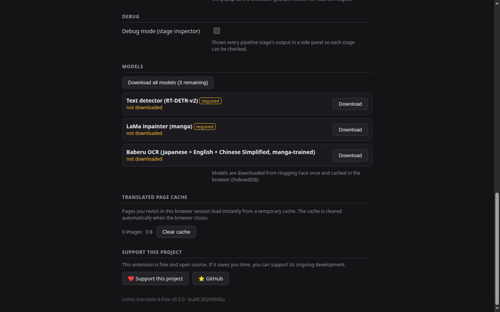
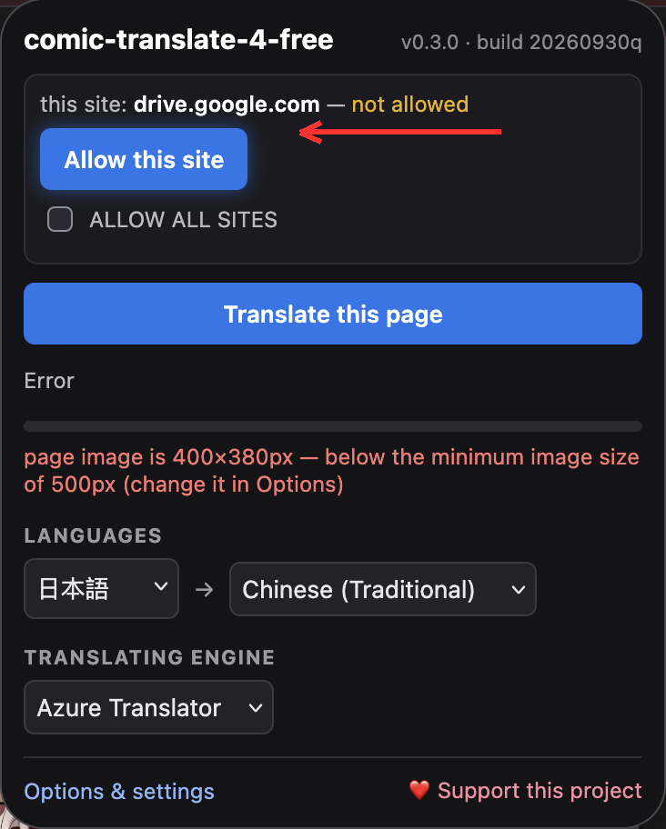

# comic-translate-4-free

**语言：** [English](README.md) · [日本語](README.ja.md) · [简体中文](README.zh-CN.md) · [繁體中文](README.zh-TW.md)

在浏览器内翻译漫画页面。完整流水线在本地运行：
气泡/文字检测（RT-DETR-v2）、OCR（日语/英语/中文用 Baberu）、通过 LaMa 图像修复擦除原文、翻译
（Google / Azure / 本地 LLM），以及将译文换行重绘回原气泡。

扩展 UI 跟随浏览器的语言设置（英语、日语、韩语、中文简体/繁体）。

由 [ogkalu2/comic-translate](https://github.com/ogkalu2/comic-translate)
移植到 Manifest V3 + ONNX Runtime Web（WASM）。

## 下载（无需构建）

从 [**Releases**](https://github.com/jameslee0623/comic-translate-4-free/releases)
页面获取可直接安装的 zip — 每个 release 都由 CI 自动构建，
同时包含 `chrome/` 和 `firefox/`。解压后按下方“安装”操作即可。
您无需克隆仓库或自行运行 `build.sh`。

## 安装

zip 中包含两个构建：`chrome/` 和 `firefox/`。

**Chrome：** 打开 `chrome://extensions` → 启用**开发者模式** →
**加载已解压的扩展程序** → 选择 `chrome/` 文件夹。

**Firefox：** 打开 `about:debugging#/runtime/this-firefox` →
**临时载入附加组件** → 打开 `firefox/` 文件夹并选择 `manifest.json`。
（临时附加组件在 Firefox 重启前有效。如需永久安装，
须使用 addons.mozilla.org 签名的构建。）

然后在选项页中下载一次模型 — 点击 **Download all models**
按钮即可获取全部（检测器、OCR 模型、修复器，共约 350MB）。
它们缓存在浏览器（IndexedDB）中，不会重复下载。
每个文件的字节大小在下载后都会校验；损坏的文件会标 ⚠
并可重新下载。



## 使用

1. **先允许该网站** — 翻译只在您明确允许的网站上运行。
   点击扩展图标并按 **Allow this site**
   （或在选项中添加主机名，或开启 **Allow all sites** 以跳过此步骤）。这是硬性门槛：
   流水线不会在其他任何网站上运行。
2. 在已允许的网站上打开漫画页面 — 页面加载完成后即自动开始翻译，
   无需点击按钮（可在选项中通过 "Auto-translate on page load" 开关）。
   每个网站首次使用时，Chrome 会请求一次性权限，
   以便扩展以完整分辨率下载页面图片。
3. 页面右上角的状态 pill 显示实时进度
   （Capturing → Detecting → OCR → …）。
   完成后，页面自身的图片会被就地替换为翻译版本 —
   原文被修复擦除，译文重绘回气泡中。

若想翻译的不是页面主图而是某一特定图片，右键点击该图片并选择
**Send to comic-translate-4-free**。该图片会被直接送入流水线 —
   即使小于最小图片尺寸也会处理 — 并就地替换。
   该菜单项仅在您已允许的网站上出现。



流水线会翻译页面上的每张图片（每次最多 50 张，从大到小），
受最小图片尺寸设置限制（默认 400px）：更小的图片会给出明确错误并跳过。
扩展直接读取页面自身的图片 — 绝不会对网页截图。

<<<<<<< HEAD
**页面缓存：** 在同一浏览器会话中再次访问的页面会从临时磁盘缓存即时加载
（缓存的是修复后的图像＋翻译文本，因此更改字号无需重新翻译即可重新渲染）。
关闭浏览器时缓存会自动清除，隐身窗口中不会使用缓存。

**选项**（右键图标 → 选项）：网站访问、页面加载时自动翻译、
源语言/目标语言、翻译后端（Google 免费 / Azure Translator / LM Studio）、
Azure 与 LM Studio 的连接测试按钮、检测阈值、
最小图片尺寸（默认 400px — 更小的捕获会被跳过）、

### LM Studio

运行启用了本地服务器的 LM Studio（默认
`http://127.0.0.1:1234`）。在选项中将后端选为
**LM Studio (local server)**，设置服务器 URL 与 API 风格 —
**LM Studio REST API v1**（向 `/api/v1/chat` 发送请求）或
**OpenAI-compatible**（向 `/v1/chat/completions` 发送请求） —
然后按 **Check LM Studio connection** 验证连接。
已加载的模型会自动检测并记住，无需填写模型名称。

## 从源码构建

无需打包器、无需 npm install — 源码本身就是扩展。
依赖：`bash`、`python3`、`rsync`、`zip` 和 `node`
（仅用于语法检查）。

```bash
git clone https://github.com/jameslee0623/comic-translate-4-free.git
cd comic-translate-4-free
./build.sh
```

这会生成 `dist/comic-translate-4-free-v<version>-<build>.zip`，
同时包含 `chrome/` 和 `firefox/`，
按上文“安装”加载即可（Chrome 以解压方式，
Firefox 以临时附加组件方式）。

`<build>` 戳来自 `src/ui/options.js` 与 `src/ui/popup.js`
顶部的 `BUILD` 常量（保持两者同步）。
构建前 bump 它，可在文件名和 UI 页脚中获得唯一戳记 —
否则您的构建与同戳记的 release 构建无法区分。

扩展每个页面只发送一次批量请求：

```
POST {server}/chat/completions
{
  "messages": [
    { "role": "user",
      "content": "Translate the following 9 text(s) from Japanese to Chinese (Traditional):\n[\"…\",\"…\"]" }
  ],
  "temperature": 0,
  "texts": ["…", "…"],
  "target": "zh-TW",
  "source": "ja"
}
```

模型应回复译文字符串的 JSON 数组 —
与输入文本数量相同、顺序一致。
较长回复中裸露的 `[...]` 也会被接受；
最后的兜底是每行一条译文。

## 调试模式

在选项中启用**调试模式**后，每个流水线阶段的输出都会显示在
侧边检查面板中：捕获的图像、检测框、文本块、
OCR 裁剪 + 识别结果、修复遮罩、修复后的页面、译文。

## 架构

```
popup / options (src/ui)
      │ chrome.runtime messages
      ▼
background — 编排、捕获、文本块、遮罩、翻译 API、
             调试输出
  ├─ Chrome: service worker + offscreen document (src/offscreen)
  │  承载全部 onnxruntime-web 会话
  │  （下载在其中执行，使 197MB 的抓取在 SW 休眠期间也能继续）
  └─ Firefox: background page (src/background/background.html)
     在进程内承载相同会话（Firefox 没有 offscreen document）
└── content script (src/content) — 浮层画布 + 文字渲染器 + 调试面板
```

模型（Hugging Face，按需下载）：
- `ogkalu/comic-text-and-bubble-detector` → `detector-v4-s_int8.onnx`
- `genshiai-daichi/baberu-ocr` → `vision_int4.onnx`、`decoder_prefill_int8.onnx`、
  `decoder_step_int8.onnx`（日语、英语、简体/繁体中文）
- `ogkalu/lama-manga-onnx-dynamic` → `lama-manga-dynamic.onnx`

流水线阶段：capture → detect → blocks → OCR → mask → inpaint →
translate → render。检测在 640×640 下运行；
纵横比超过 3.5:1 的高图以重叠垂直切片处理。

**Chrome 与 Firefox 流水线：** 两个构建版本都在 OCR 之后并行执行翻译与
mask/inpaint。Chrome 通过 Promise.all 并行 —— ML 会话运行在 offscreen
文档的独立线程中，因此各阶段真正重叠执行。Firefox 在 Web Worker（独立线程）
中运行翻译，mask → inpaint 在主线程运行 —— 即使 WASM inpaint 占用主线程，
Worker 的网络 I/O 也不会被阻塞。（Firefox 之前采用线性的 mask → inpaint →
translate 顺序；单线程的后台页面无法在不卡死的情况下运行并行分支。）

## 已知限制

- 没有好的韩语 OCR — 源语言为日语、英语、简体/繁体中文。
- 自动翻译每页只处理一张图片（页面的主图）。
  要翻译页面上的其他图片，请右键点击它并选择
  **Send to comic-translate-4-free**。
- Firefox：AI 模型在浏览器的后台页面内运行（Firefox 没有离屏文档），
  与其他所有内容共享内存。在非常大的页面或长时间使用后，引擎可能内存不足
  并报告 "no available backend found"。重启浏览器可释放内存；Chrome 不受影响，
  因为它在独立进程中运行模型。
- Chrome：在一个会话中翻译数十张图片可能导致浏览器崩溃
  （在缓存约 35 张图片时观察到）。
- 页面缓存是会话级的：浏览器启动时会被清空，因此重启后（包括崩溃后），
  重新发送的图片会走完整流程，不会命中缓存。
- 本地 LLM 后端为实验性（需要 WebGPU + 数 GB 下载）。
- Google 后端使用非官方 `translate.googleapis.com` 端点，
  可能被限流；Azure 需要您自己的密钥。
- OCR 引擎：Baberu（日语/英语/中文）。
- Baberu 的解码器在上游训练时使用 64 字符标签上限（`--max-text-len 64`），
  因此单次裁剪最多只返回约 64 个字符。较长的气泡会自动切成重叠的小块重新
  OCR 并拼接还原（最多约 4×64 字符）；调试面板的 OCR 标签会标出触及上限的裁剪。
- 竖排文字针对高 CJK 文本块渲染；气泡外的拟声词等
  使用独立文本框。

## 第三方声明

捆绑的库、移植的代码、运行时下载的模型及其许可证，
见 [THIRD-PARTY-NOTICES.md](THIRD-PARTY-NOTICES.md)。

## 支持本项目

如果这个扩展对你有帮助，欢迎支持它的开发：

[](https://ko-fi.com/S5X627XJQW)
