# comic-translate-4-free

**Language:** [English](README.md) · [हिन्दी](README.hi.md) · [日本語](README.ja.md) · [简体中文](README.zh-CN.md) · [繁體中文](README.zh-TW.md) · [Español](README.es.md) · [العربية](README.ar.md) · [Français](README.fr.md) · [বাংলা](README.bn.md) · [Português](README.pt.md) · [Русский](README.ru.md) · [Tiếng Việt](README.vi.md) · [Bahasa Indonesia](README.id.md) · [اردو](README.ur.md) · [Deutsch](README.de.md)

直接在瀏覽器裡，用你的語言看漫畫。

comic-translate-4-free 會在你瀏覽時自動翻譯漫畫與漫畫頁面。它可讀取日語、英語、簡體與繁體中文（自動偵測），並翻譯成 114 種語言。開啟頁面後，翻譯好的版本會直接原地取代原始圖片——對話框裡填滿你的語言。

### 📸 Before & After

| 之前（日語） | 之後（繁體中文） |
| --- | --- |
| 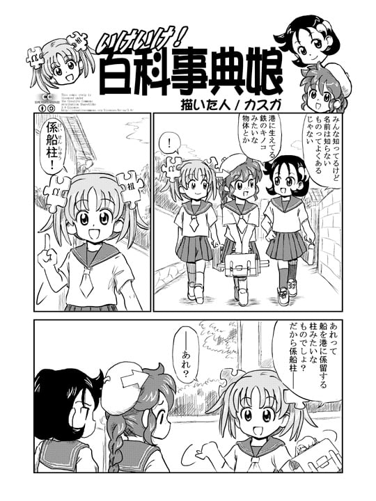 | 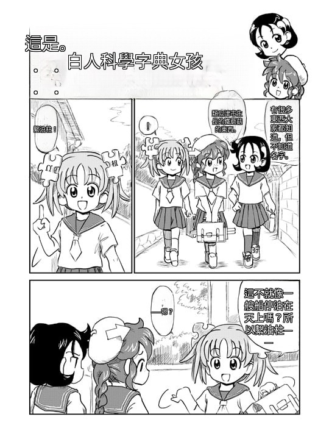 |

查看另外 14 種語言的翻譯

| 印地語 | 韓語 | 簡體中文 |
| --- | --- | --- |
| 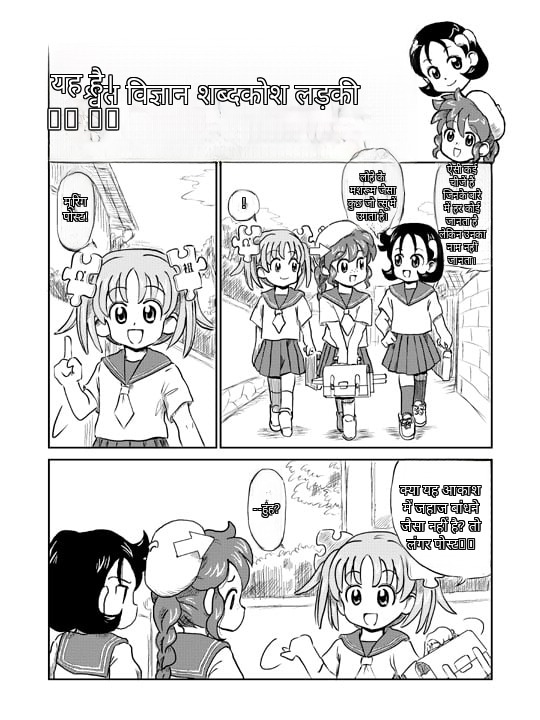 | 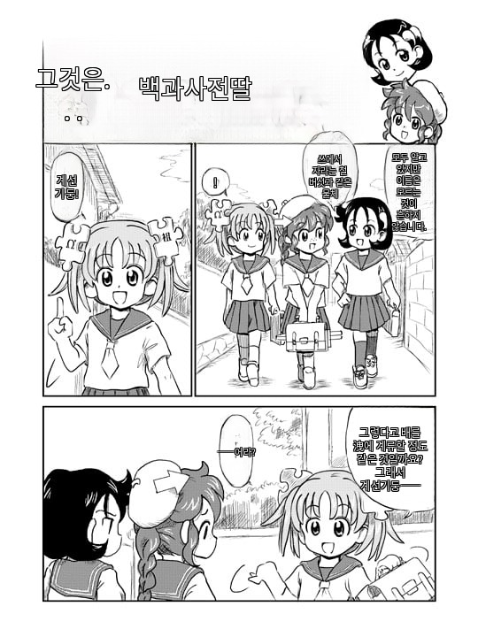 |  |

| 繁體中文 | 西班牙語 | 阿拉伯語 |
| --- | --- | --- |
|  | 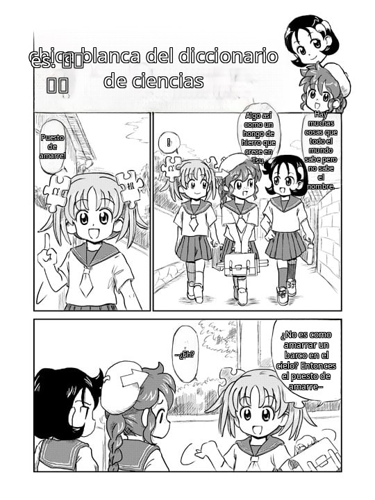 | 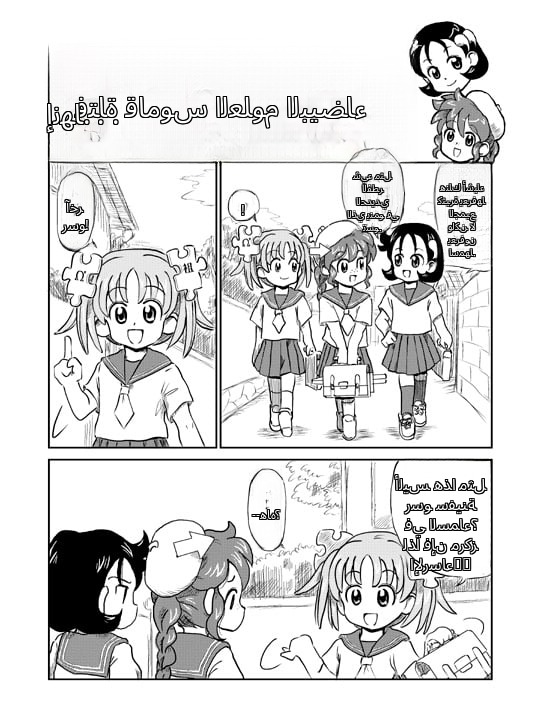 |

| 法語 | 孟加拉語 | 葡萄牙語 |
| --- | --- | --- |
| 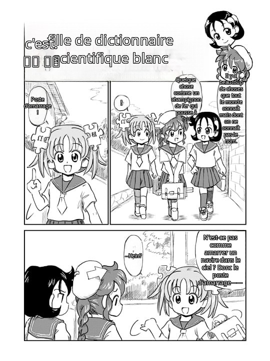 | 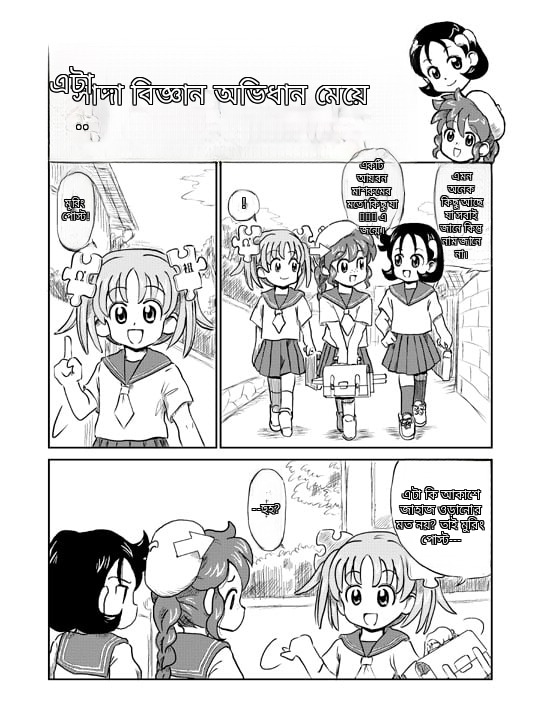 | 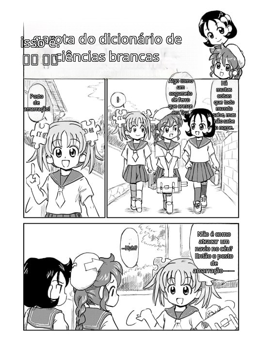 |

| 俄語 | 越南語 | 印尼語 |
| --- | --- | --- |
| 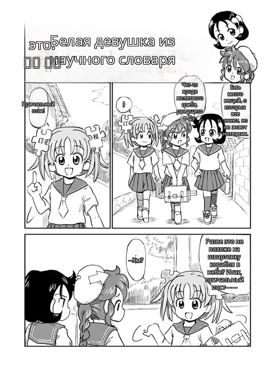 | 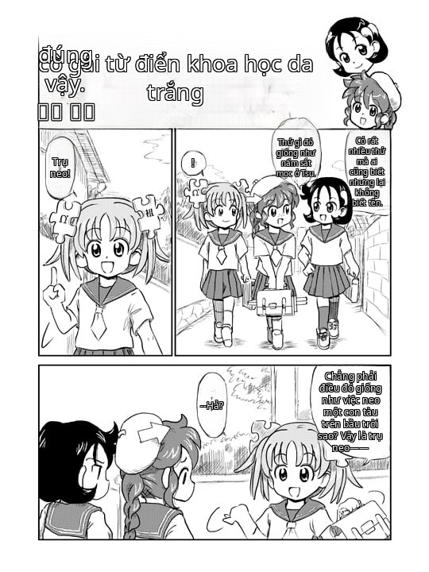 | 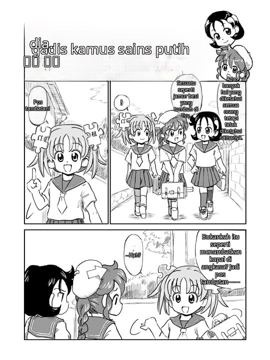 |

| 烏爾都語 | 德語 |
| --- | --- |
|  | 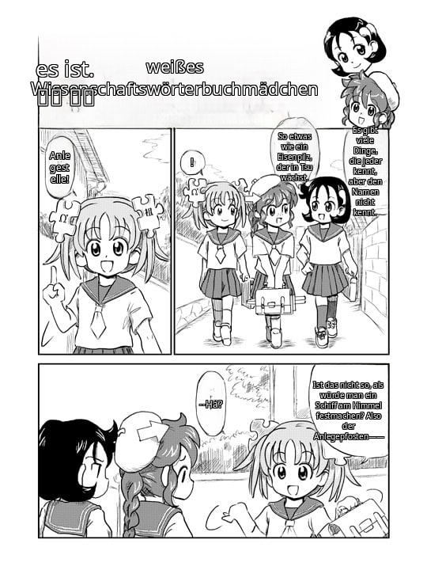 |

*原圖出處：[維基百科](https://en.wikipedia.org/wiki/Manga)，經由 Wikimedia Commons。*

---

## ✨ 功能

- **自動翻譯** — 在已授權的網站上打開漫畫頁面，翻譯版本會直接原地出現，不需按任何按鈕。
- **右鍵點任何圖片** — 選擇「Send to comic-translate-4-free」即可翻譯指定的圖片，即使小於最小尺寸也能翻譯。
- **114 種目標語言** — 透過 Google Translate、Azure Translator，或你自己的本機 LM Studio 伺服器。
- **來源語言自動偵測** — 從 OCR 識別的文字自動辨識日語、英語、簡體／繁體中文。
- **長條漫畫／條漫支援** — 高大的頁面會以重疊分段處理，讓文字保持清晰。
- **16 種介面語言** — 擴充功能的介面會跟隨你的瀏覽器語言設定。

### 🔒 隱私

- **AI 完全在本機運作。** 對話框偵測、OCR 與填補修復都透過 WebAssembly 在你的瀏覽器中本機執行。你的頁面從不離開你的裝置。
- **只會送出待翻譯的文字** — 只有提取出的文字會傳送給你選擇的翻譯服務（Google／Azure／你本機的 LM Studio）。
- **無帳號、無追蹤、無遙測。** 所有設定與快取的模型都保存在你的瀏覽器本機儲存空間。

---

## 🚀 安裝

**Chrome／Edge／Brave：**

[**從 Chrome 線上應用程式商店安裝**](https://chromewebstore.google.com/detail/pndooikgcenncdohfggodonniihplppj) — 一鍵安裝，自動更新。

**Firefox：** 從 [Releases](https://github.com/jameslee0623/comic-translate-4-free/releases) 下載 Firefox 壓縮檔，然後前往 `about:debugging#/runtime/this-firefox` → **Load Temporary Add-on** → 選擇 `manifest.json`。（暫用擴充功能會在重啟後卸載；正式的 AMO 上架正在進行中。）

安裝完成後，開啟設定頁並點擊 **Download all models** 一次（約 350 MB：偵測器、OCR、填補模型）。模型會快取在瀏覽器中並以檔案大小驗證。

---

## 💡 使用方式

1. **先允許該網站** — 點擊擴充功能圖示並按下 **Allow this site**（或啟用 **ALLOW ALL SITES**）。翻譯只會在你授予權限的網站上執行。

   

2. **重新載入漫畫頁面** — 頁面載入時會自動開始翻譯。右上角的藥丸形指示器會即時顯示進度（Capturing → Detecting → OCR → …）。
3. **完成** — 頁面的圖片會原地替換為翻譯好的版本。

**小技巧：**
- 在任何圖片上按右鍵 → **Send to comic-translate-4-free**，只翻譯那張圖片。

  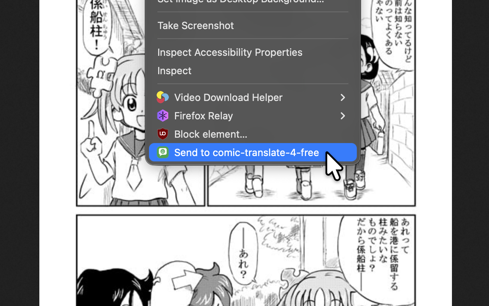

- 如果網站阻擋下載（HTTP 403），擴充功能會自動改用背景分頁重試。
- 在設定中選擇你的翻譯引擎：Google（免費、不需金鑰）、Azure Translator（金鑰請按下方方式申請 — 每月 200 萬字元免費），或 LM Studio（本機伺服器）。
- 在設定中啟用 **Debug mode** 可檢視每個處理階段的狀態。

---

## 🔑 申請 Microsoft Azure 帳號

若要使用 Azure Translator 作為翻譯引擎：

1. 建立或登入 Microsoft／hotmail／Azure 帳號
2. 建立 Azure 訂用帳戶
3. 建立 Azure Translator 資源
4. 選擇 F0（Free）定價層 — 每月 200 萬字元，永久免費
5. 前往「資源管理」→「金鑰和端點」→ 複製 **KEY 1** 與 **Location/Region**
6. 貼到擴充功能的設定頁面中

---

## ❤️ 支持這個專案

如果這個擴充功能對你有幫助，歡迎支持它的開發：

---

## ⚠️ 已知問題

- **尚不支援韓語 OCR** — 來源語言為日語、英語、簡體／繁體中文。（韓語仍可作為翻譯目標語言。）
- **自動翻譯每頁一張圖片**（頁面的主要圖片）。使用右鍵 → 傳送可翻譯其他圖片。
- **大量圖片工作階段** — 單一工作階段翻譯數十張圖片可能導致瀏覽器當機。若發生此狀況，請在設定中清除頁面快取。
- **Firefox** — 模型在背景頁執行（沒有 offscreen documents），與其他程序共用記憶體。若看到「no available backend found」，請重新啟動瀏覽器。
- Google Translate 使用非官方免費端點，可能會被限流。

---

## 📄 第三方聲明

本專案受到 [ogkalu2/comic-translate](https://github.com/ogkalu2/comic-translate) 的啟發 — 對話框／文字偵測器與漫畫微調版 LaMa 填補模型皆為其 ONNX 導出版本，推論邏輯也移植自它。（OCR 使用 genshiai-daichi 的 [Baberu](https://huggingface.co/genshiai-daichi/baberu-ocr)。）

綑綁的函式庫、移植的程式碼與執行時下載的模型，均已附上授權資訊，詳見 [THIRD-PARTY-NOTICES.md](THIRD-PARTY-NOTICES.md)。

MIT 授權 — 詳見 [LICENSE](LICENSE)。
